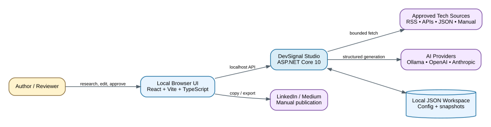
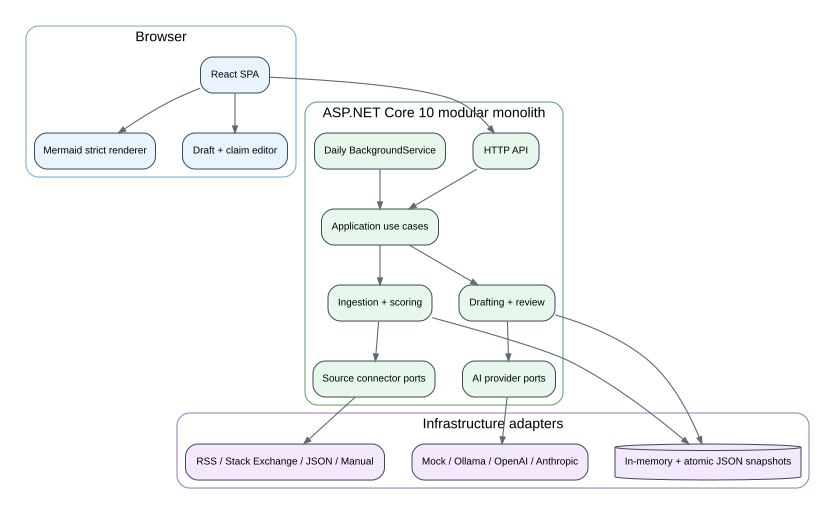
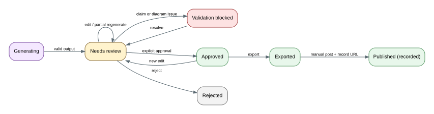

# DevSignal Studio Architecture

## 1. Executive summary

DevSignal Studio is a **single-user, local-first, modular monolith**. It collects technology signals from configured sources, normalizes and deduplicates them, scores them against a configurable career/content taxonomy, uses a selected AI provider to produce evidence-linked drafts and Mermaid diagrams, and places those drafts in a human review queue. It does not publish automatically in the initial release.

The architecture optimizes for four things:

1. **Useful daily output, not maximum collection volume.** Deterministic filters reduce noise before AI is used.
2. **Provider and source independence.** AI vendors and content sources are adapters behind stable interfaces.
3. **Trustworthy authorship.** Every draft retains provenance, claim support, generation metadata, and revision history.
4. **Easy local operation with a clean growth path.** One process and no database server now; replaceable persistence, queues, and deployment later.

## 2. Goals

- Run entirely on a developer workstation.
- Collect fresh material daily from approved RSS feeds, APIs, local JSON files, and manual imports.
- Focus on full-stack AI-powered .NET engineering, system design, interviews, leadership, communication, cloud, DevOps, performance, security, career growth, and adjacent technology.
- Generate LinkedIn-ready short-form drafts, Medium-ready long-form drafts, interview explainers, roadmaps, and visual Mermaid diagrams.
- Let the user edit, approve, reject, regenerate, and export content before manual publication.
- Support Ollama, OpenAI, Anthropic, OpenAI-compatible APIs, and additional providers without changing core workflows.
- Add new source connectors, content recipes, channels, and storage implementations with low coupling.

## 3. Non-goals for the first release

- Automated LinkedIn or Medium posting.
- Multi-user authentication, teams, or cloud hosting.
- Web crawling at internet scale.
- A message broker, Kubernetes, or microservice deployment.
- A vector database as a mandatory dependency.
- Autonomous tools that execute source-provided instructions.
- Copying full third-party articles into generated posts.

## 4. Architectural decisions

| Area | Decision | Rationale |
|---|---|---|
| Application shape | Modular monolith with ports and adapters | Fast local development and debugging; module boundaries still support later extraction. |
| Backend | ASP.NET Core 10 Web API plus hosted background worker | One process can serve APIs, static assets, scheduled ingestion, health checks, and DI-managed adapters. |
| Frontend | React + Vite + TypeScript | Fast local feedback, typed feature modules, and straightforward Mermaid rendering. |
| Runtime storage | In-memory repositories | Matches the requested lightweight local model and keeps reads fast. |
| Durability | Atomic JSON snapshots, enabled by default | A daily review queue must survive process restarts; this adds durability without a database server. |
| Diagrams | Mermaid source as the canonical representation | Editable, diffable, renderable to SVG/PNG, and suitable for AI output. |
| AI | Capability-based provider abstraction and task router | Different tasks can use different models; providers can be swapped or disabled. |
| Source ingestion | Connector abstraction; RSS/API/JSON/manual first | Avoids dependence on a model's browsing ability and keeps source behavior auditable. |
| Publishing | Human approval and manual posting | Protects quality, account safety, voice, and factual accuracy. |
| Scheduling | Built-in `BackgroundService` for v1 | No external scheduler is needed for a local single-process app. |
| Extensibility | Explicit interfaces and module registration | New adapters are added through DI without changing domain logic. |

## 5. System context



Editable source: [`diagrams/mermaid/01-system-context.mmd`](diagrams/mermaid/01-system-context.mmd)

The browser UI is the only user-facing surface. It calls the local API. The API owns orchestration, configuration, source connectors, AI providers, storage, and review workflows. External content is always treated as untrusted input.

## 6. Container and module view



Editable source: [`diagrams/mermaid/02-container-view.mmd`](diagrams/mermaid/02-container-view.mmd)

### Backend modules

| Module | Responsibility | Important boundaries |
|---|---|---|
| `Sources` | Source definitions, connector selection, health, rate limits | Knows transport details; does not decide content value. |
| `Ingestion` | Fetch, normalize, canonicalize, deduplicate, record runs | Produces source-neutral `ContentItem` objects. |
| `Taxonomy` | Topic definitions, weights, aliases, exclusions | Loaded from JSON and versioned. |
| `Relevance` | Deterministic scoring, optional AI classification, novelty scoring | AI augments rather than replaces deterministic checks. |
| `AiOrchestration` | Provider routing, retries, usage metadata, structured output parsing | No source connector directly calls a model. |
| `Drafting` | Prompt assembly, recipes, claim ledger, draft revisions | Requires source references and preserves provenance. |
| `Diagrams` | Mermaid generation, sanitization, syntax validation contract | No scripts, click handlers, or unsafe Mermaid directives. |
| `Review` | Draft status, edits, approval, rejection, export | Only reviewed content leaves the app. |
| `Workspace` | In-memory state and JSON snapshot persistence | Hidden behind repositories. |
| `Observability` | Structured logs, run metrics, provider latency/cost metadata | No secrets or full private prompts in normal logs. |

### Frontend feature modules

- `dashboard`: daily run status, queue counts, source health, topic mix.
- `discover`: collected signals, relevance reasons, filters, source provenance.
- `drafts`: editor, revision history, claim support, channel previews.
- `diagrams`: Mermaid source editor, strict renderer, SVG/PNG export.
- `sources`: connector configuration, test connection, enable/disable.
- `settings`: AI routing, schedule, profile voice, storage mode.
- `activity`: ingestion and generation run logs.

## 7. End-to-end content pipeline


Editable source: [`diagrams/mermaid/03-content-pipeline.mmd`](diagrams/mermaid/03-content-pipeline.mmd)

### Pipeline stages

1. **Trigger** — daily scheduler or an explicit “Run now” action.
2. **Fetch** — enabled connectors retrieve bounded batches and honor rate limits.
3. **Normalize** — map source-specific fields to the canonical content model.
4. **Canonicalize and deduplicate** — normalize URLs and calculate content fingerprints.
5. **Deterministic pre-filter** — reject obvious ads, job listings, duplicated announcements, and off-topic items.
6. **Score** — calculate topic relevance, freshness, authority, novelty, learning value, and career alignment.
7. **Optional AI classification** — add structured labels and explanations when a provider is available.
8. **Candidate selection** — retain the highest-value, non-repetitive items within a daily budget.
9. **Draft generation** — apply a channel recipe and personal voice profile.
10. **Claim and attribution checks** — connect factual claims to source references; mark uncertain claims.
11. **Diagram generation** — produce sanitized Mermaid text and validate it before display.
12. **Review queue** — edit, regenerate selected sections, approve, reject, or archive.
13. **Export** — copy plain text, download Markdown, or export an SVG/PNG diagram for manual posting.

## 8. Scoring model

The first-stage score is deterministic and transparent:

```text
FinalScore =
  0.30 * TopicRelevance
+ 0.15 * Freshness
+ 0.15 * SourceAuthority
+ 0.15 * LearningValue
+ 0.10 * CareerAlignment
+ 0.10 * Novelty
+ 0.05 * DiscussionPotential
- DuplicatePenalty
- HypePenalty
```

All weights and thresholds are configuration. The UI shows a score explanation rather than only a number. AI classification can suggest adjustments but cannot silently override hard exclusions.

Recommended default bands:

- `75–100`: strong candidate for drafting
- `55–74`: retain for review or weekly roundup
- `<55`: archive unless manually promoted

## 9. Topic model

The default taxonomy is in [`../config/topics.json`](../config/topics.json). It includes:

- C#, .NET, ASP.NET Core, Web API, Entity Framework Core, LINQ, dependency injection, background services, SignalR, gRPC.
- React, Vite, TypeScript, web performance, accessibility, state management, CSS, HTML, PWA, WebSockets.
- LLM fundamentals, structured outputs, tool calling, RAG, embeddings, agents, prompt engineering, evaluation, guardrails, local models, AI-assisted SDLC.
- MCP servers, resources, prompts, tools, transport, authorization, consent, and secure tool design.
- API design, clean architecture, DDD, CQRS, event-driven systems, microservices, modular monoliths, CAP, caching, CDN, load balancing, concurrency, reliability, databases, NoSQL, messaging, reactive systems.
- Azure, AWS, serverless, containers, Docker, Kubernetes, CI/CD, infrastructure as code, observability, GitOps, platform engineering, FinOps.
- Performance profiling, async/concurrency, .NET GC and memory, database optimization, caching, load testing, capacity planning.
- Security, OWASP, identity, OAuth/OIDC, secrets, supply chain, threat modeling, cryptography.
- Unit, integration, contract, UI, performance, mutation, and AI evaluation testing.
- DSA and interview topics: arrays, strings, hash tables, stacks, queues, linked lists, trees, tries, heaps, graphs, recursion, sorting, searching, dynamic programming, greedy algorithms, backtracking, Big-O, system design interviews.
- Senior/staff engineering growth, leadership, mentoring, stakeholder communication, design reviews, incident leadership, decision records, roadmap creation, influence without authority.
- Adjacent ecosystem awareness: Java, Go, Rust, Python, Node.js, GraphQL, SQL/NoSQL, Redis, MongoDB, Cosmos DB, and selected legacy .NET topics.

## 10. Canonical domain model

```text
SourceDefinition
  id, name, connectorType, endpoint, enabled, trustWeight,
  pollSchedule, tags, limits, complianceNotes, connectorSettings

ContentItem
  id, sourceId, externalId, canonicalUrl, title, summary, bodyExcerpt,
  author, publishedAt, collectedAt, tags, fingerprint, status,
  score, scoreBreakdown, provenance

TopicMatch
  topicId, confidence, matchedTerms, explanation, classifier

Draft
  id, contentItemIds[], recipeId, channel, title, hook, body,
  hashtags[], mermaid, claims[], references[], status,
  revision, generationMetadata, createdAt, updatedAt

Claim
  id, text, supportStatus, sourceItemIds[], sourceUrls[], reviewerNote

IngestionRun / GenerationRun
  id, startedAt, completedAt, status, counters, errors, timings

ProfileSettings
  audience, goals, voice, bannedPhrases, preferredFormats,
  contentPillars, cadence, defaultProviderRoutes
```

## 11. Review state machine



Editable source: [`diagrams/mermaid/04-review-workflow.mmd`](diagrams/mermaid/04-review-workflow.mmd)

A draft can only be exported as “approved” after:

- at least one source reference exists;
- unsupported claims are resolved, removed, or explicitly marked as opinion;
- Mermaid passes sanitization and syntax validation when a diagram is present;
- required channel fields are present;
- the user performs the approval action.

## 12. Core extension contracts

```csharp
public interface IContentSourceConnector
{
    string Kind { get; }
    Task<ConnectorHealth> CheckHealthAsync(SourceDefinition source, CancellationToken ct);
    IAsyncEnumerable<RawContentItem> FetchAsync(
        SourceDefinition source,
        IngestionCursor? cursor,
        CancellationToken ct);
}

public interface IAiProvider
{
    string ProviderId { get; }
    AiCapabilities Capabilities { get; }
    Task<AiHealth> CheckHealthAsync(CancellationToken ct);
    Task<StructuredGeneration<T>> GenerateStructuredAsync<T>(
        AiRequest request,
        JsonSchemaContract schema,
        CancellationToken ct);
}

public interface IContentWorkspace
{
    Task<IReadOnlyList<ContentItem>> QueryItemsAsync(ContentQuery query, CancellationToken ct);
    Task UpsertItemsAsync(IEnumerable<ContentItem> items, CancellationToken ct);
    Task<IReadOnlyList<Draft>> QueryDraftsAsync(DraftQuery query, CancellationToken ct);
    Task SaveDraftAsync(Draft draft, CancellationToken ct);
}

public interface IChannelFormatter
{
    string Channel { get; }
    ValidationResult Validate(Draft draft, ContentRecipe recipe);
    ExportArtifact Format(Draft draft, ContentRecipe recipe);
}
```

Adapters register through module extension methods, for example:

```csharp
services.AddContentConnector<RssConnector>("rss");
services.AddContentConnector<StackExchangeConnector>("stackexchange");
services.AddAiProvider<OllamaProvider>("ollama");
services.AddAiProvider<OpenAiProvider>("openai");
```

No application service switches directly on vendor names; a factory or keyed DI resolves configured adapters.

## 13. Source strategy

### Supported first

- **RSS/Atom:** official engineering blogs, Medium profile/publication/topic feeds, dev.to tags, vendor release blogs.
- **REST/JSON APIs:** Stack Exchange, Hacker News, GitHub releases, and future search providers.
- **Custom JSON files:** curated links, copied notes, newsletters, or exports.
- **Manual item/URL import:** LinkedIn, Quora, and sites without an approved public feed/API.

### Connector policy

- Prefer an official API or feed over HTML extraction.
- Never bypass authentication, paywalls, robots controls, or access restrictions.
- Store excerpts and metadata, not full copyrighted articles, unless the content is owned by the user or explicitly licensed.
- Preserve the original URL, author, publisher, publication time, and retrieval time.
- Treat all source text as untrusted data and never as model/system instructions.
- Each source configuration carries `complianceNotes`, `trustWeight`, and rate limits.

## 14. AI provider architecture

### Capability model

Providers declare whether they support:

- text generation;
- structured JSON output;
- tool calling;
- embeddings;
- vision;
- streaming;
- token/usage reporting.

The task router chooses providers by task, not globally. Example:

```text
classify  -> Ollama -> OpenAI -> deterministic-only
summarize -> Ollama -> Anthropic -> OpenAI
longDraft -> Anthropic -> OpenAI -> Ollama
diagram   -> Ollama -> OpenAI -> template fallback
embed     -> Ollama -> OpenAI -> disabled
```

### Configuration and secrets

- Non-secret settings live in JSON.
- API keys are referenced by environment-variable name or .NET user secrets.
- Secret values never return from the settings API.
- Provider responses are normalized into a common result containing model, latency, token counts when available, finish reason, warnings, and raw-response diagnostics only when debug mode is explicitly enabled.
- The mock provider is the default so the application works without any external account.

### Prompt composition

Prompts are versioned files and are assembled from trusted instructions plus delimited untrusted source data. Output is requested against a JSON schema. Invalid output follows a bounded repair path and then falls back to a template rather than silently storing malformed data.

## 15. Mermaid handling

Mermaid text is stored alongside every draft. The frontend initializes Mermaid with strict security. Backend sanitization rejects:

- `click` directives;
- initialization directives that alter security settings;
- raw HTML labels when not explicitly allowed;
- external image URLs;
- payloads over configured size limits.

A diagram failure does not discard the draft. It places the diagram in `NeedsRepair` and preserves the source for manual editing or one bounded regeneration attempt.

## 16. Storage design

### Default mode: `JsonSnapshot`

- Repositories maintain immutable/in-memory snapshots for reads.
- Changes are serialized through a per-file asynchronous lock.
- Writes go to a temporary file, are flushed, and atomically replace the previous snapshot.
- A small backup rotation protects against partial corruption.
- Separate files keep write scopes narrow: `sources.json`, `items.json`, `drafts.json`, `runs.json`, and `settings.json`.
- A schema version is stored in every file for future migration.

### Optional mode: `MemoryOnly`

Useful for demonstrations and tests. Everything is lost when the process stops.

### Future mode

`IContentWorkspace` can be implemented by SQLite, PostgreSQL, or a document store without changing endpoints or use cases.

## 17. API shape

The complete first-pass contract is in [`API_CONTRACT.md`](API_CONTRACT.md). Major groups:

- `/api/v1/dashboard`
- `/api/v1/sources`
- `/api/v1/ingestion`
- `/api/v1/items`
- `/api/v1/drafts`
- `/api/v1/topics`
- `/api/v1/recipes`
- `/api/v1/providers`
- `/api/v1/settings`
- `/api/v1/runs`
- `/health/live` and `/health/ready`

Commands return run IDs for operations that may take time. The frontend polls run status in v1; server-sent events can be added later without changing command semantics.

## 18. Local deployment

### Development

```text
React/Vite dev server: http://localhost:5173
ASP.NET Core API:      http://localhost:5210
Ollama (optional):     http://localhost:11434
```

Vite proxies `/api` and `/health` to the API. CORS accepts only configured local origins.

### Single-process local build

The frontend production build is copied into the API `wwwroot` directory. ASP.NET Core serves static assets and the SPA fallback, so one `dotnet run` command launches the entire local application.

### Future deployment path

1. Replace JSON persistence with SQLite for larger local history.
2. Split the scheduler/worker from the API only when background workloads justify it.
3. Add a durable queue when multi-process execution is introduced.
4. Add authentication before binding beyond loopback or deploying remotely.
5. Containerize after the local workflows are stable, not before.

## 19. Security and trust boundaries

See [`SECURITY_AND_TRUST.md`](SECURITY_AND_TRUST.md). Highest-priority risks are prompt injection, SSRF through configurable sources, XSS in previews, unsafe Mermaid, secret leakage, copyrighted-content overcollection, and accidental publication. The architecture contains explicit controls for each.

## 20. Observability

Each run records:

- source fetch count and failure count;
- new, duplicate, filtered, and selected item counts;
- scoring distribution and top matched topics;
- provider/model, latency, retry count, and token/usage metadata when available;
- draft and diagram validation outcomes;
- sanitized error categories.

Structured logs use correlation IDs: `ingestionRunId`, `generationRunId`, `itemId`, and `draftId`.

## 21. Testing strategy

- **Domain unit tests:** scoring, URL canonicalization, fingerprints, state transitions, recipe validation.
- **Connector contract tests:** fixture-based RSS, Atom, Stack Exchange, and custom JSON parsing.
- **Provider contract tests:** recorded/synthetic responses; no paid API required in CI.
- **Application integration tests:** end-to-end ingestion to review queue using mock connectors/providers and a temporary JSON workspace.
- **API tests:** endpoint validation, cancellation, error contracts, pagination.
- **Frontend tests:** API client, filters, editor state, Mermaid sanitization, approval requirements.
- **Architecture tests:** dependency direction and forbidden references.
- **Golden prompt tests:** schema compliance and no unsupported-claim regression.

## 22. Proposed repository layout

```text
DevSignal.Studio/
├─ DevSignal.Studio.sln
├─ src/
│  ├─ backend/
│  │  ├─ DevSignal.Domain/
│  │  ├─ DevSignal.Application/
│  │  ├─ DevSignal.Infrastructure/
│  │  └─ DevSignal.Api/
│  └─ frontend/
│     ├─ src/app/
│     ├─ src/features/
│     ├─ src/components/
│     └─ src/lib/
├─ tests/
│  ├─ DevSignal.Domain.Tests/
│  ├─ DevSignal.Application.Tests/
│  ├─ DevSignal.Infrastructure.Tests/
│  └─ frontend/
├─ config/
│  ├─ topics.json
│  ├─ sources.json
│  ├─ ai-providers.json
│  ├─ content-recipes.json
│  └─ prompts/
├─ data/                 # gitignored except samples
├─ docs/
├─ scripts/
└─ README.md
```

## 23. Recommended MVP boundary

The first usable slice should do exactly this:

1. Load topics, source definitions, recipes, and profile settings from JSON.
2. Ingest from local JSON, RSS/Atom, and Stack Exchange.
3. Deduplicate and score items.
4. Display candidates and score explanations.
5. Generate a LinkedIn explainer with the mock provider and one configured AI provider.
6. Render and edit a Mermaid diagram.
7. Approve and export plain text/Markdown/SVG.
8. Run manually and once daily while the application is open.

Everything else belongs behind interfaces or in the backlog until this loop is reliable.
